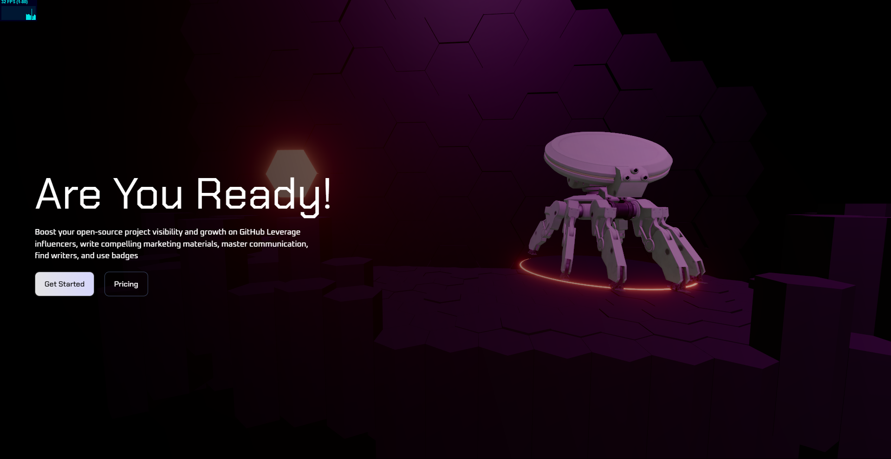
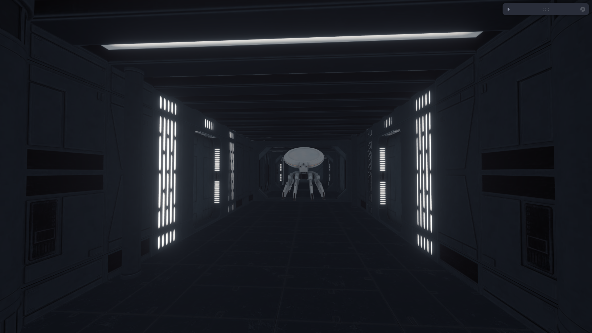
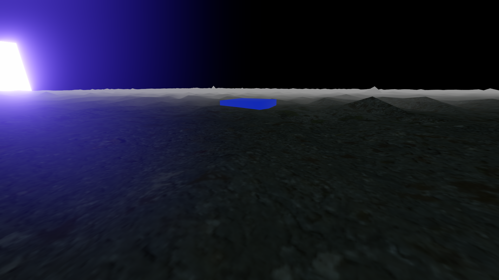
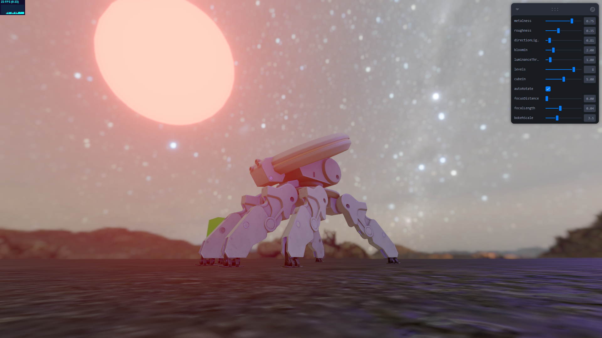

# Remodeling-2 🚀🎨

Welcome to **Remodeling-2**, the playground where React Three Fiber experiments meet creativity! This repo is where I flexed my 3D muscles, broke a few (virtual) bones 🦴, and learned **a LOT** about the beauty of 3D graphics. 

---

## 🌟 What is this?

It's my **React Three Fiber Testing Zone**! Think of it as the mad scientist's lab – but with meshes, transformations, and a pinch of chaos thrown in. I've conducted several experiments (safely, I promise 😅) and documented my results with 4 stunning screenshots. They're basically my proudest moments captured in pixels. 🖼️

---

## 📸 Screenshots

Here’s a quick preview of the results of my experiments:

| Screenshot | Description |
|------------|-------------|
|  | Experiment 1: Some cool 3D transformation magic ✨ |
|  | Experiment 2: Objects floating in glorious space 🚀 |
|  | Experiment 3: Lights, camera, and... action? 🎥 |
|  | Experiment 4: Dynamic interactions that (hopefully) worked 😅 |

---

## 🧪 Lessons Learned

>[!TIP] 
>**Every mistake is an opportunity to learn, and boy, did I make some!**

Through these experiments, I’ve dived deep into:

- 🎮 Mastering React Three Fiber (or at least taming it... somewhat!)
- 📐 Understanding 3D matrices and transformations
- 🤖 Debugging weird stuff (ever seen a cube float off to another galaxy? Yeah, me too.)

---

## ⚠️ Important Notices & Cautions

>[!IMPORTANT] 
>This repo is a testing ground, not a finished product. Expect creative chaos and surprises. 

>[!CAUTION]
>Some experiments might be heavy on your GPU. Keep an eye on your FPS and make sure your device doesn't overheat! 🥵

>[!TIP] 
>Use a dark theme for your editor. Bright themes and 3D debugging = instant regret. 😵‍💫

---

## 🎉 How to Enjoy This Repo

1. Clone it like you mean it:
   ```bash
   git clone https://github.com/Yuslash/Remodeling-2.git
   ```
2. Install the magic potions (dependencies):
   ```bash
   npm install
   ```
3. Enter the Matrix (start the dev server):
   ```bash
   npm start
   ```
4. Marvel at my experiments and maybe laugh a little at my mistakes. 🤷‍♂️

---

## ✍️ Contributing

Feel free to fork, clone, or just casually browse the code. If you have suggestions or ideas, raise an issue or hit me up! But remember, **don’t judge too hard** – this repo is all about learning and experimenting. ❤️

---

## 🧹 Fun Facts & Jokes

- Why did the cube go to therapy? **It had too many corners to deal with.** 🤣
- Debugging at 2 AM makes you question reality itself. 
- "React Three Fiber is like cooking – add too many ingredients, and you’ve got a mess!" 🍳

---

## ⭐️ Star This Repo

If you like this chaotic, fun-filled adventure, consider starring ⭐ the repo. It’ll make my day and give me the motivation to continue breaking… I mean, learning things. 😁

---

### Made with 🔥 by **Yuslash CrimsonConnor** 

